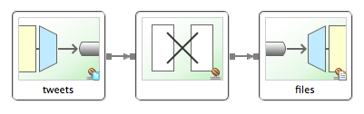

:spring_boot_version: 0.5.0.M6
:SpringSocial: http://projects.spring.io/spring-social/
:Component: http://docs.spring.io/spring/docs/4.0.0.RC1/javadoc-api/org/springframework/stereotype/Component.html
:EnableAutoConfiguration: http://docs.spring.io/spring-boot/docs/{spring_boot_version}/api/org/springframework/boot/autoconfigure/EnableAutoConfiguration.html
:DispatcherServlet: http://docs.spring.io/spring/docs/4.0.0.RC1/javadoc-api/org/springframework/web/servlet/DispatcherServlet.html
:SpringApplication: http://docs.spring.io/spring-boot/docs/{spring_boot_version}/api/org/springframework/boot/SpringApplication.html
:gs-register-twitter-app: link:/guides/gs/register-twitter-app
:toc:
:icons: font
:source-highlighter: prettify
:project_id: gs-integration
This guide walks you through the process of using Spring Integration to create a simple application that retrieves data from Twitter, manipulates the data, and then writes it to a file.

== What you'll build

You'll create a flow using Spring Integration.

== What you'll need

include::https://raw.github.com/spring-guides/getting-started-macros/master/prereq_editor_jdk_buildtools.adoc[]

include::https://raw.github.com/spring-guides/getting-started-macros/master/how_to_complete_this_guide.adoc[]

[[scratch]]
== Set up the project
include::https://raw.github.com/spring-guides/getting-started-macros/master/build_system_intro.adoc[]

include::https://raw.github.com/spring-guides/getting-started-macros/master/create_directory_structure_hello.adoc[]

include::https://raw.github.com/spring-guides/getting-started-macros/master/create_both_builds.adoc[]

`build.gradle`
// AsciiDoc source formatting doesn't support groovy, so using java instead
[source,java]
----
include::initial/build.gradle[]
----

include::https://raw.github.com/spring-guides/getting-started-macros/master/bootstrap_starter_pom_disclaimer.adoc[]

[[initial]]
== Define an integration plan

For this guide's sample application, you will define a Spring Integration plan that reads tweets from Twitter, transforms them into an easily readable `String`, and appends that `String` to the end of a file.

To define an integration plan, you simply create a Spring XML configuration with a handful of elements from Spring Integration's XML namespaces. Specifically, for the desired integration plan, you work with elements from these Spring Integration namespaces: core, twitter, and file.

The following XML configuration file defines the integration plan:

`src/main/resources/hello/integration.xml`
[source,xml]
----
include::complete/src/main/resources/hello/integration.xml[]
----

As you can see, three integration elements are in play here:

 * `<twitter:search-inbound-channel-adapter>`. An inbound adapter that searches Twitter for tweets with "#HelloWorld" in the text. It is injected with a `TwitterTemplate` from {SpringSocial}[Spring Social] to perform the actual search. As configured here, it polls every 5 seconds. Any matching tweets are placed into a channel named "tweets" (corresponding with the adapter's ID).
 * `<int:transformer>`. Transformed tweets in the "tweets" channel, extracting the tweet's author (`payload.fromUser`) and text (`payload.text`) and concatenating them into a readable `String`. The `String` is then written through the output channel named "files".
 * `<file:outbound-channel-adapter>`. An outbound adapter that writes content from its channel (here named "files") to a file. Specifically, as configured here, it will append anything in the "files" channel to a file at `/tmp/si/HelloWorld`.

This simple flow is illustrated like this:

The integration plan references two beans that aren't defined in `integration.xml`: the "twitterTemplate" bean that is injected into the search inbound adapter and the "newline" bean referenced in the transformer. Those beans will be declared separately in JavaConfig as part of the main class of the application.

== Make the application executable

Although it is common to configure a Spring Integration plan within a larger application, perhaps even a web application, there's no reason that it can't be defined in a simpler standalone application. That's what you do next, creating a main class that kicks off the integration plan and also declares a handful of beans to support the integration plan. You also build the application into a standalone executable JAR file.

`src/main/java/hello/Application.java`
[source,java]
----
include::complete/src/main/java/hello/Application.java[]
----

As you can see, this class provides a `main()` method that loads the Spring application context. It's also annotated as a `@Configuration` class, indicating that it will contain bean definitions.

Specifically, three beans are created in this class:

 * The `newline()` method creates a simple `String` bean containing the underlying system's newline character(s). This is used in the integration plan to place a newline at the end of the transformed tweet `String`.
 * The `twitterTemplate()` method defines a `TwitterTemplate` bean that is injected into the `<twitter:search-inbound-channel-adapter>`.
 * The `oauth2Template()` method defines a Spring Social `OAuth2Template` bean used to obtain a client access token when creating the `TwitterTemplate` bean.

The `oauth2Template()` method references the `Environment` to get "clientId" and "clientSecret" properties. Those properties are ultimately client credentials you are given when you {gs-register-twitter-app}[register your application with Twitter]. Fetching them from the `Environment` means you don't have to hardcode them in this configuration class. You'll need them when you <<run>>, though.

Finally, notice that `Application` is configured with `@ImportResource` to import the integration plan defined in `/hello/integration.xml`. 

include::https://raw.github.com/spring-guides/getting-started-macros/master/build_an_executable_jar_subhead.adoc[]
include::https://raw.github.com/spring-guides/getting-started-macros/master/build_an_executable_jar_with_both.adoc[]

[[run]]
== Run the application

Now you can run the application from the jar:
....
java -DclientId={YOUR CLIENT ID} -DclientSecret={YOUR CLIENT SECRET} -jar build/libs/{project_id}-0.1.0.jar

... app starts up ...
....

Make sure you specify your application's client ID and secret in place of the placeholders shown here.

Once the application starts up, it connects to Twitter and starts fetching tweets that match the search criteria of "#HelloWorld". The application processes those tweets through the integration plan you defined, ultimately appending the tweet's author and text to a file at `/tmp/si/HelloWorld`.

After the application has been running for awhile, you should be able to view the file at `/tmp/si/HelloWorld` to see the data from a handful of tweets. On a UNIX-based operating system, you can also choose to tail the file to see the results as they are written:

----
tail -f /tmp/si/HelloWorld
----

You should see something like this (the actual tweets may differ):

....
BrittLieTjauw  :  Now that I'm all caught up on the bachelorette I can leave my room #helloworld
mishra_ravish  :  Finally, integrated #eclim. #Android #HelloWorld
NordstrmPetite  :  Pink and fluffy #chihuahua #hahalol #boo #helloworld http://t.co/lelHhFN3gq
GRhoderick  :  Ok Saint Louis, show me what you got. #HelloWorld
....

== Summary
Congratulations! You have developed a simple application that uses Spring Integration to fetch tweets from Twitter, process them, and write them to a file. 

