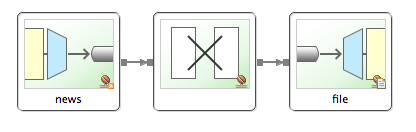

:spring_version: current
:spring_boot_version: 1.3.0.RELEASE
:SpringSocial: http://projects.spring.io/spring-social/
:Component: http://docs.spring.io/spring/docs/{spring_version}/javadoc-api/org/springframework/stereotype/Component.html
:EnableAutoConfiguration: http://docs.spring.io/spring-boot/docs/{spring_boot_version}/api/org/springframework/boot/autoconfigure/EnableAutoConfiguration.html
:DispatcherServlet: http://docs.spring.io/spring/docs/{spring_version}/javadoc-api/org/springframework/web/servlet/DispatcherServlet.html
:SpringApplication: http://docs.spring.io/spring-boot/docs/{spring_boot_version}/api/org/springframework/boot/SpringApplication.html
:gs-register-twitter-app: link:/guides/gs/register-twitter-app
:toc:
:icons: font
:source-highlighter: prettify
:project_id: gs-integration
This guide walks you through the process of using Spring Integration to create a simple application that retrieves data from an RSS Feed (Spring Blog), manipulates the data, and then writes it to a file. This guide uses traditional Spring Integration XML configuration; other guides exist showing the use of JavaConfig/DSL with and without JDK 8 Lambda expressions.

== What you'll build

You'll create a flow using Spring Integration.

== What you'll need

:java_version: 1.8
include::https://raw.githubusercontent.com/spring-guides/getting-started-macros/master/prereq_editor_jdk_buildtools.adoc[]

include::https://raw.githubusercontent.com/spring-guides/getting-started-macros/master/how_to_complete_this_guide.adoc[]

include::https://raw.githubusercontent.com/spring-guides/getting-started-macros/master/hide-show-gradle.adoc[]

include::https://raw.githubusercontent.com/spring-guides/getting-started-macros/master/hide-show-maven.adoc[]

include::https://raw.githubusercontent.com/spring-guides/getting-started-macros/master/hide-show-sts.adoc[]

[[initial]]
== Define an integration flow

For this guide's sample application, you will define a Spring Integration flow that reads blog posts from Spring IO's RSS feed, transforms them into an easily readable `String` consisting of the post title and the URL for the post, and appends that `String` to the end of a file `/tmp/si/SpringBlog`.

To define an integration flow, you simply create a Spring XML configuration with a handful of elements from Spring Integration's XML namespaces. Specifically, for the desired integration flow, you work with elements from these Spring Integration namespaces: core, feed, and file.

The following XML configuration file defines the integration flow:

`src/main/resources/blog/integration.xml`
[source,xml]
----
include::complete/src/main/resources/blog/integration.xml[]
----

As you can see, three integration elements are in play here:

 * `<feed:inbound-channel-adapter>`. An inbound adapter that retrieves the posts, one per poll. As configured here, it polls every 5 seconds. The posts are placed into a channel named "news" (corresponding with the adapter's ID).
 * `<int:transformer>`. Transforms entries (`com.rometools.rome.feed.synd.SyndEntry`) in the "news" channel, extracting the entry's title (`payload.title`) and link (`payload.link`) and concatenating them into a readable `String` (adding a newline). The `String` is then sent to the output channel named "file".
 * `<file:outbound-channel-adapter>`. An outbound channel adapter that writes content from its channel (here named "file") to a file. Specifically, as configured here, it will append anything in the "file" channel to a file at `/tmp/si/SpringBlog`.

This simple flow is illustrated like this:

== Make the application executable

Although it is common to configure a Spring Integration flow within a larger application, perhaps even a web application, there's no reason that it can't be defined in a simpler standalone application. That's what you do next, creating a main class that kicks off the integration flow and also declares a handful of beans to support the integration flow. You also build the application into a standalone executable JAR file. We use Spring Boot's `SpringApplication` to create the application context.

`src/main/java/blog/Application.java`
[source,java]
----
include::complete/src/main/java/blog/Application.java[]
----

include::https://raw.githubusercontent.com/spring-guides/getting-started-macros/master/build_an_executable_jar_subhead.adoc[]
include::https://raw.githubusercontent.com/spring-guides/getting-started-macros/master/build_an_executable_jar_with_both.adoc[]

[[run]]
== Run the application

Now you can run the application from the jar:
....
java -jar build/libs/{project_id}-0.1.0.jar

... app starts up ...
....

Once the application starts up, it connects to the RSS feed and starts fetching blog posts. The application processes those posts through the integration flow you defined, ultimately appending the post information to a file at `/tmp/si/SpringBlog`.

After the application has been running for awhile, you should be able to view the file at `/tmp/si/SpringBlog` to see the data from a handful of posts. On a UNIX-based operating system, you can also choose to tail the file to see the results as they are written:

----
tail -f /tmp/si/SpringBlog
----

You should see something like this (the actual news will differ):

....
Spring Integration Java DSL 1.0 GA Released @ https://spring.io/blog/2014/11/24/spring-integration-java-dsl-1-0-ga-released
This Week in Spring - November 25th, 2014 @ https://spring.io/blog/2014/11/25/this-week-in-spring-november-25th-2014
Spring Integration Java DSL: Line by line tutorial @ https://spring.io/blog/2014/11/25/spring-integration-java-dsl-line-by-line-tutorial
Spring for Apache Hadoop 2.1.0.M2 Released @ https://spring.io/blog/2014/11/14/spring-for-apache-hadoop-2-1-0-m2-released
....

== Summary
Congratulations! You have developed a simple application that uses Spring Integration to fetch blog posts from spring.io, process them, and write them to a file.

include::https://raw.githubusercontent.com/spring-guides/getting-started-macros/master/footer.adoc[]

